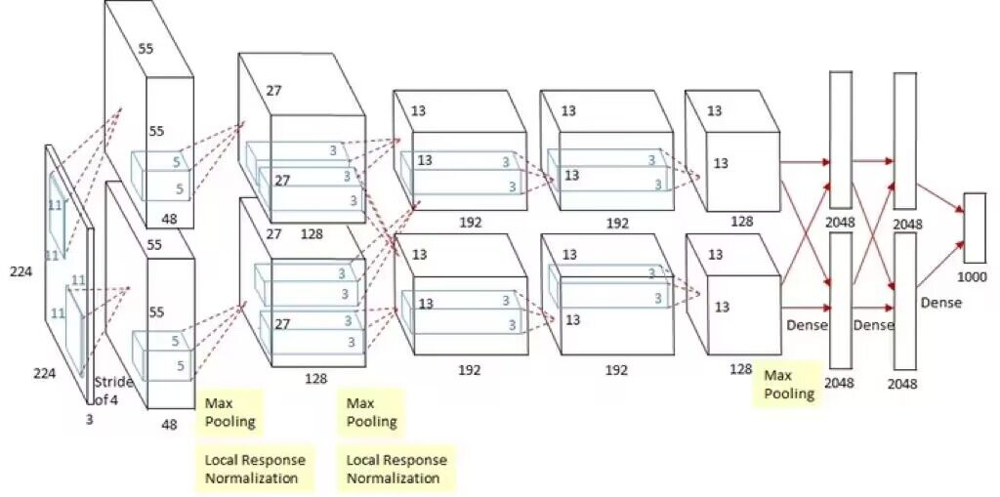

# 利用AlexNet，VGG模型实现花卉图像分类

### 依赖包

所需的环境包：

```python
import torch
import torch.nn as nn
import torch.optim as optim
from torch.utils.data import DataLoader
from torchvision import datasets, transforms, models
```

### 数据预处理

首先，对数据进行预处理操作并加载图像，创建一个字典data_trainsform：

* 对训练集("train")：
  * 利用`RandomResizedCrop(224)`函数随机裁剪图像到224*224大小
  * 利用`RandomHorizontalFlip()`函数随机水平翻转图像
  * 利用`ToTensor()`图像转换为PyTorch张量
* 对测试集("test")：
  * 利用`Resize(256)`函数将图像的短边缩放为256，且长宽比不变
  * 利用`CenterCrop(224)`从中心裁剪224*224大小图像对输入图像进行标准化

### 定义模型AlexNet/VGG

**AlexNet基本结构**

AlexNet共8层: **5个卷积层(CONV1——CONV5) 3个全连接层(FC6-FC8)**

AlexNet输入为RGB三通道的224 × 224 × 3大小的图像（也可填充为227 × 227 × 3 ）。AlexNet 共包含5 个卷积+池化层（包含3个池化）和 3 个全连接层。其中，每个卷积层都包含卷积核、偏置项、ReLU激活函数和局部响应归一化（LRN）模块。第1、2、5个卷积层后面都跟着一个最大池化层，后三个层为全连接层。最终输出层为softmax，将网络输出转化为概率值，用于预测图像的类别。




在该代码中设置了：

* 添加一个自适应平均池化层，将特征图的大小调整为 (6, 6)
*  添加一个Dropout层，用于随机失活以防止过拟合
* 全连接层，输入大小为 256 * 6 * 6（来自卷积层和池化层的输出），输出大小为 4096
* 非线性激活函数 ReLU，inplace=True 表示直接在原地修改张量而不复制
* 两个相同结构的全连接层和激活函数
* 最终的全连接层，输出大小为 `num_classes`

定义前向传播：

* 输入数据通过特征提取部分（卷积层）
* 特征图通过自适应平均池化层
* 将特征图展平为一维向量，`start_dim=1` 表示从第一个维度（通道维度）开始展平
* 展平后的特征向量通过分类器部分，得到最终的输出

**VGG基本结构**

VGG16相比AlexNet的一个改进是**采用连续的几个3x3的卷积核代替AlexNet中的较大卷积核（11x11，7x7，5x5）**。在VGG中，使用了3个3x3卷积核来代替7x7卷积核，使用了2个3x3卷积核来代替5*5卷积核，这样做的主要目的是在保证具有相同感知野的条件下，提升了网络的深度，在一定程度上提升了神经网络的效果。

这里使用的是VGG16：包含了16个隐藏层（13个卷积层和3个全连接层）


白色矩形框：代表卷积和激活函数

红色矩形框：代表最大池化下载量

蓝色矩形框：全连接层和激活函数

橙色矩形框：softmax处理

### Train

* 将模式设置为训练模式`model.train()`
* 初始化参数
  * running_loss,correct_train,total_train
* 每轮将优化器梯度缓存清零，Pytorch会默认积累梯度
* outputs接收训练模型
* loss计算损失
* `loss.backward()`反向传播计算梯度
* `optimizer.step()`更新模型参数


### Test

* `model.eval()`模型设置为评估模式，关闭层随机失活
* 计算准确率


### 总结

训练结果表名，VGG模型在花卉识别上优于AlexNet模型。


# VGG-AlexNet-Flower-classification-experiment
# VGG-AlexNet-Flower-classification-experiment
# VGG-AlexNet-Flower-classification-experiment
